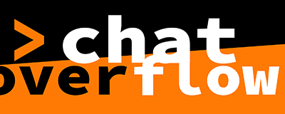

<p align="center">
  
</p>

Imagine an [IFTTT](https://ifttt.com/), solely developed for livestreaming. 
Living in a event-triggered environment, chat overflow reacts on inputs like twitch chat, sub messages, bits, ...

Looking for a new chat bot, stream overlay or custom lighting in your living room, whenever someone subscribes?
Everything can be developed with the easy-to-use API from the chat overflow framework.

One example: Chatbot. Starting with two lines of code:

```
 twitchChat = require.input.twitchChat(...)
 twitchChat.get.registerMessageHandler(msg => ...)
```

Chat overflow fills the gap between simple but limited services like IFTTT and own from-scratch developed applications.

*Current development state: **Pre-Alpha***

## Chat Overflow Framework
The framework contains all information to connect to livestream inputs and outputs. Combined with the [API Project](https://github.com/codeoverflow-org/chatoverflow-api), plugins can be executed. They provide defined behavior, e.g. the [public plugins](https://github.com/codeoverflow-org/chatoverflow-plugins).

### Development

Start with the [Installation](https://github.com/codeoverflow-org/chatoverflow/wiki/Installation). Then learn more about the [CLI](https://github.com/codeoverflow-org/chatoverflow/wiki/Using-the-CLI).

Please see the wiki to learn how to code new [platform sources](https://github.com/codeoverflow-org/chatoverflow/wiki/Adding-a-new-platform-source) and new [plugins](https://github.com/codeoverflow-org/chatoverflow/wiki/Writing-a-plugin).

### Usage

Chat Overflow releases are not yet available. ETA Q2 2019.

### About Code Overflow

Code Overflow started as a coding-livestream project by three computer science students @ [KIT, Karlsruhe](http://www.kit.edu/) and is headed by [skate702](http://skate702.de).